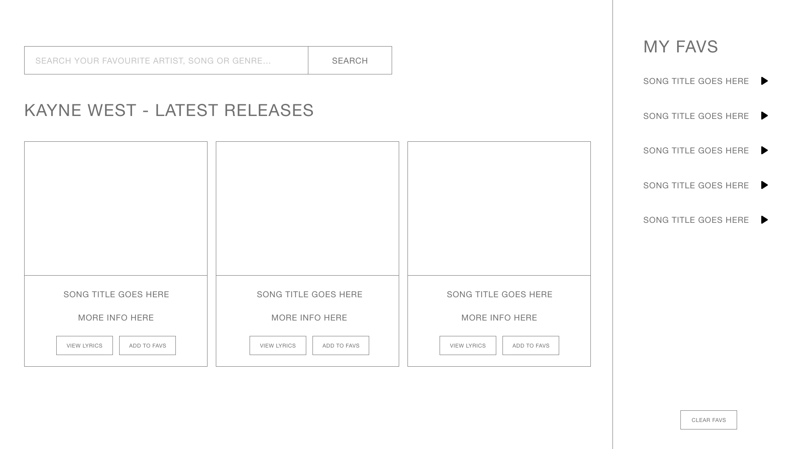
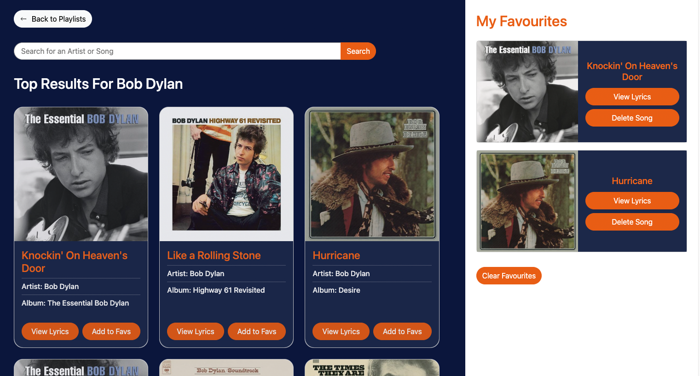
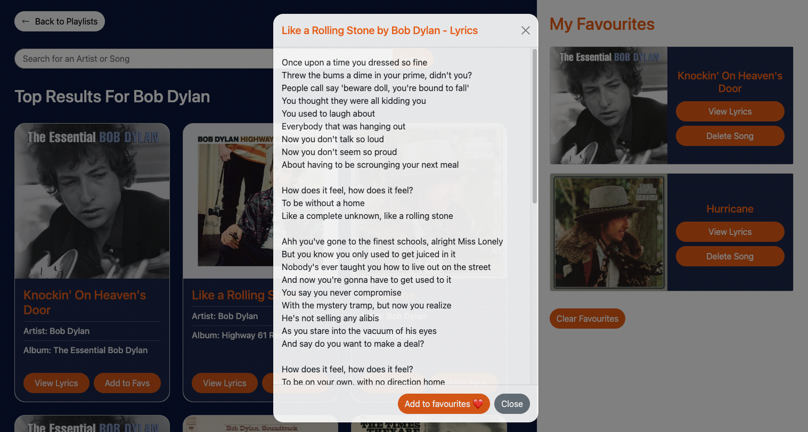

# Favourite Music Dashboard 

## Description

Link to deployed application: https://cedekpoole.github.io/favourite-music-dashboard/ 

Welcome to the repo! The 'Favourite Music Dashboard' is a web application that allows users to effortlessly find their favourite artists and songs. With ease and accessibility in mind, this application is to be used by users for the purpose of finding song lyrics without having to scour the internet for them. Frequently, music fans struggle to find the lyrics of their favourite songs. They may not remember all the words or they may want to sing along to a song they’ve never heard before. Our project solves this issue - users are able to save specific songs and view the lyrics in just a few clicks. The app provides a more comprehensive and accurate source of lyrics, ensuring that users can find the lyrics they’re looking for.

This project was a collaborative venture (contributors listed below). As a team, we practiced agile development where our first objective was to create a MVP (minimum viable product). This entailed the implementation of core features - in addition to the elimination of any overarching bugs - in order to get a working version of the app. While following agile principles, it was of crucial importance to have an early version up and running prior to the implementation of additional features. Soon after, we created a colour scheme and styled the page to fit the theme that we were aiming for. The final step was adding supplementary functionality to the page. 

The mockup above was used as a guide and reference for how we should structure our application. We used bootstrap - the most popular CSS framework for building responsive websites - as means to help with the styling and structuring of the page. The modal components were particularly helpful to us in our aim of creating a clean, modern website. We used the JavaScript library 'jQuery' to aid us with DOM tree transversal and manipulation. Not only that, we sent Ajax (Asynchronous JavaScript and XML) requests via jQuery using the $.ajax method, allowing us to retreive data in JSON (JavaScript Object Notation) format from server-side APIs. We used two server-side APIs for this project: 'Deezer' and 'Some Random API'. 

### Technologies Used: 
- HTML, CSS
- Javascript
- [Bootstrap (v5.3)](https://getbootstrap.com/)
- [jQuery (v3.6.3)](https://api.jquery.com/)
- Server-side APIs ([Deezer](https://developers.deezer.com/api) for the artist info and [Some Random API](https://some-random-api.ml/docs/welcome/introduction) for the song lyrics)

### User Story: 
As a music lover, I want to be able to search and store my favourite songs and easily access the lyrics for each saved song. 

### General Acceptance Criteria:
- Use Bootstrap.

- Be deployed to GitHub Pages.

- Be interactive (in other words, accept and respond to user input).

- Use at least two server-side APIs Links to an external site..

- Use modals instead of alerts, confirms, or prompts.

- Use client-side storage to store persistent data.

- Be responsive.

- Have a polished UI.

- Have a clean repository that meets quality coding standards (file structure, naming conventions, best practices for class/id naming conventions, indentation, quality comments, and so on).

- Have a quality README (including a unique name, description, technologies used, screenshot, and link to the deployed application).
Provide a short description explaining the what, why, and how of your project. Use the following questions as a guide:

## Installation 

N/A

## Usage 

### Users

To visit the website, [please click this link.](https://cedekpoole.github.io/favourite-music-dashboard/)

You will be directed to the webpage where you can enter an artist and/or a song name, you will then be shown the search results for that particular input. When the 'Add to Favs' button is clicked, the song will be stored as persistent data in local storage, being placed in the aside section of the page for easy access. 

When the 'View Lyrics' button is clicked, users can view the lyrics for that particular song from within a modal pop up. From within the modal, users are also given the option to add those lyrics to favourites so it can be stored as persistent data. 

### Developers
1. Navigate to the main page of the repository
2. Click the green ‘Code’ button and copy the SSH or HTTPS key
3. In terminal (Mac) or Git Bash (Windows) clone into the directory you want the repo in using the ‘git clone’ command followed by pasting your SSH or HTTPS key
4. Open the directory in your code editor
5. Inspect the html and js files to see how the application works!

## Credits 

Project contributors: 
- [bethanyryalls](https://github.com/bethanyryalls)
    - Created the skeleton of the page (HTML + Bootstrap)
    - Dynamically generated the playlist and the search result cards
    - Implemented the 'load more' buttons 
    - Added responsiveness to page and had creative input on page design 
    - General refactoring of code base

- [c4rli](https://github.com/c4rli)
    - Managed the lyrics server-side API
    - Retrieved lyric data and created modals for the lyric buttons 
    - Dealt with ajax request errors 
    - Creative input on page design
    - General refactoring of code base

- [DollyA-bit](https://github.com/DollyA-bit)
    - Picked the colour scheme of the page

- [cedekpoole](https://github.com/cedekpoole)
    - Dynamically generated the 'favourite songs' cards
    - Added functionality to said cards (delete songs individually or collectively + stop duplication)
    - Dealt with local storage
    - Managed the README file
    - General refactoring of code base

## License 

Please refer to the LICENSE in the repo. 

---

## Features

- The user can search for either an artist or a specific song for easy access to lyrics
- All cards on the page are generated dynamically via jQuery 
- Modals have been used for the lyric buttons 
- 'Load more' button has been implemented
- Favourite songs are saved to local storage
- When an error occurs, a modal pop up is returned 
- Delete each favourite song - which is stored in local storage - individually or collectively
- When a song is already added to favourites, a modal pops up that states that the song is already in the favourites section
- **Coming Soon**: A variety of playlists are shown on the welcome screen (to give users more choice on the playlists they want to look at)

## Roadmap 

- Use Youtube Data API to add the music video of that particular song in the modal?
- Add the audio for each song in the lyric modal
- ~~Add playlist cards to the welcome screen (to give users more choice on the playlists they want to look at)~~ **DONE**: in forked version of repo - need to merge with main branch
- ~~Create a logo for the page~~ **DONE**: has been pushed to main